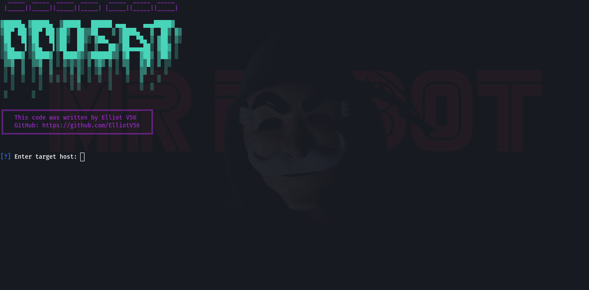

# DDoS Attack Tool


**Disclaimer**: This tool is for educational and research purposes only. Unauthorized use against any network or system without explicit permission is illegal. The developer assumes no liability and is not responsible for any misuse or damage caused by this program.


  


## 📝 Description
A Python-based DDoS (Distributed Denial of Service) testing tool that simulates UDP flood attacks for network stress testing and educational purposes.


## Installation  
Tested On :

    Kali Linux
    BlackArch Linux
    Ubuntu
    Kali Nethunter
    Termux 
    Parrot OS


## 🛠️ Features
- Multi-threaded UDP flood attack
- Cross-platform (Windows/Linux)
- Color-coded console output
- Real-time attack statistics
- CTRL+C graceful termination

## 📸 Screenshots  

### **SCREENSHOTS**  
  


### Prerequisites  
- 𝙆𝘼𝙇𝙄 
- 𝐓𝐄𝐑𝐌𝐔𝐗 
-  𝐏𝐚𝐫𝐫𝐨𝐭 𝐎𝐒 
-  𝐔𝐛𝐮𝐧𝐭𝐮 


## ⚙️ Requirements
- Python 3.6+

## 📥 Installation
```bash
-sudo apt install python3-pip (optional)
-git clone https://github.com/ElliotV56/DDOS-ATTACK.git
-cd  DDOS-ATTACK
-python3 DDos.py
